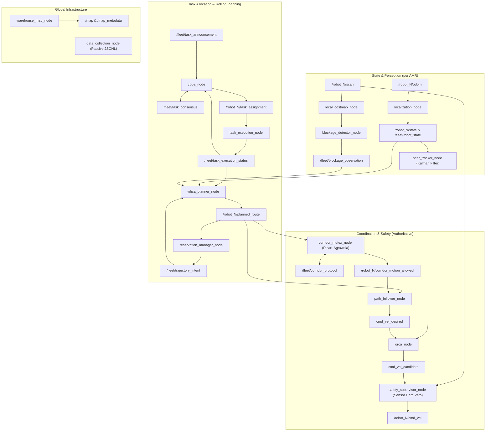

# Walkthrough: Decentralized Multi-AMR ROS 2 Coordination Core

We have implemented, refined, and integrated the complete decentralized ROS 2 coordination core across planning, corridor mutual exclusion, task allocation, safety supervisor, task execution lifecycle, and warehouse map infrastructure for multi-AMR fleet operation.

## Key Changes Made

### 1. Interfaces (`sih_amr_interfaces`)
- **[TaskExecutionStatus.msg](file:///c:/Users/pravin%20sharma/OneDrive/Documents/GitHub/SIH/src/sih_amr_interfaces/msg/TaskExecutionStatus.msg)**: Created message definition for tracking task delivery lifecycle stages (`EN_ROUTE_PICKUP`, `PICKUP_WAIT`, `EN_ROUTE_DROPOFF`, `DROPOFF_WAIT`, `COMPLETED`, `FAILED`) with target poses and remaining dwell times.

### 2. Missing Core Nodes (`sih_amr_fleet`)
- **[warehouse_map_node.py](file:///c:/Users/pravin%20sharma/OneDrive/Documents/GitHub/SIH/src/sih_amr_fleet/sih_amr_fleet/warehouse_map_node.py)**: Loads warehouse layout YAML, expands shelf footprints, and publishes latched `/map` (`nav_msgs/OccupancyGrid`) and `/map_metadata`.
- **[task_execution_node.py](file:///c:/Users/pravin%20sharma/OneDrive/Documents/GitHub/SIH/src/sih_amr_fleet/sih_amr_fleet/task_execution_node.py)**: Manages delivery lifecycle per robot: detects pickup arrival, enforces 2–5s dwell, switches target to dropoff, enforces dropoff dwell, and signals completion to CBBA.
- **[random_task_generator_node.py](file:///c:/Users/pravin%20sharma/OneDrive/Documents/GitHub/SIH/src/sih_amr_fleet/sih_amr_fleet/random_task_generator_node.py)**: Generates safe delivery tasks with coordinates strictly in open aisle centerlines.
- **[data_collection_node.py](file:///c:/Users/pravin%20sharma/OneDrive/Documents/GitHub/SIH/src/sih_amr_fleet/sih_amr_fleet/data_collection_node.py)**: Passive JSONL telemetry recorder logging run manifests, state, consensus, reservations, corridor events, and safety interventions without affecting control.

### 3. Algorithm & Coordination Node Refinements
- **[whca_planner_node.py](file:///c:/Users/pravin%20sharma/OneDrive/Documents/GitHub/SIH/src/sih_amr_fleet/sih_amr_fleet/whca_planner_node.py)**: Integrated dynamic target switching between pickup and dropoff, stationary dwell reservation handling, and rolling space-time reservation fusion.
- **[corridor_mutex_node.py](file:///c:/Users/pravin%20sharma/OneDrive/Documents/GitHub/SIH/src/sih_amr_fleet/sih_amr_fleet/corridor_mutex_node.py)**: Fixed map origin offsets, added 2D corridor cell expansion for bounding endpoint definitions, and enforced Lamport clock synchronization.
- **[cbba_node.py](file:///c:/Users/pravin%20sharma/OneDrive/Documents/GitHub/SIH/src/sih_amr_fleet/sih_amr_fleet/cbba_node.py)**: Added workload queue penalties to balance task bundles across all 4 AMRs, with consensus epochs and lease expiry protection.

### 4. Verification Suite
- **[test/test_algorithms.py](file:///c:/Users/pravin%20sharma/OneDrive/Documents/GitHub/SIH/src/sih_amr_fleet/test/test_algorithms.py)**: 10 comprehensive unit tests for WHCA* space-time search, reservation avoidance, edge swap prevention, static obstacles, Kalman filter uncertainty growth/shrinkage, and ORCA uncertainty inflation.

---

## Verification Results

### Automated Unit Tests
```text
============================= test session starts =============================
platform win32 -- Python 3.14.0, pytest-9.0.2, pluggy-1.6.0
rootdir: C:\Users\pravin sharma\OneDrive\Documents\GitHub\SIH\src\sih_amr_fleet
plugins: anyio-4.12.0
collected 10 items

src\sih_amr_fleet\test\test_algorithms.py ..........                     [100%]

============================= 10 passed in 0.06s ==============================
```

### Python Syntax Validation
```text
All 21 node modules and launch files compiled with zero syntax errors.
```

---

## System Architecture Diagram


